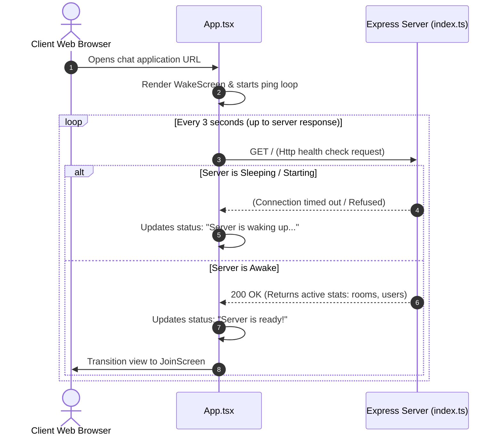
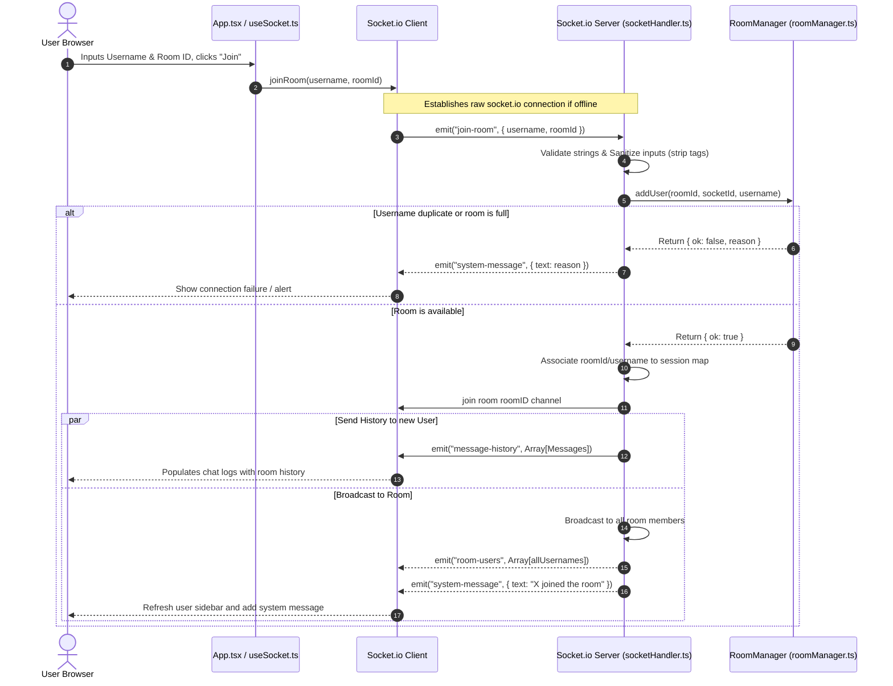
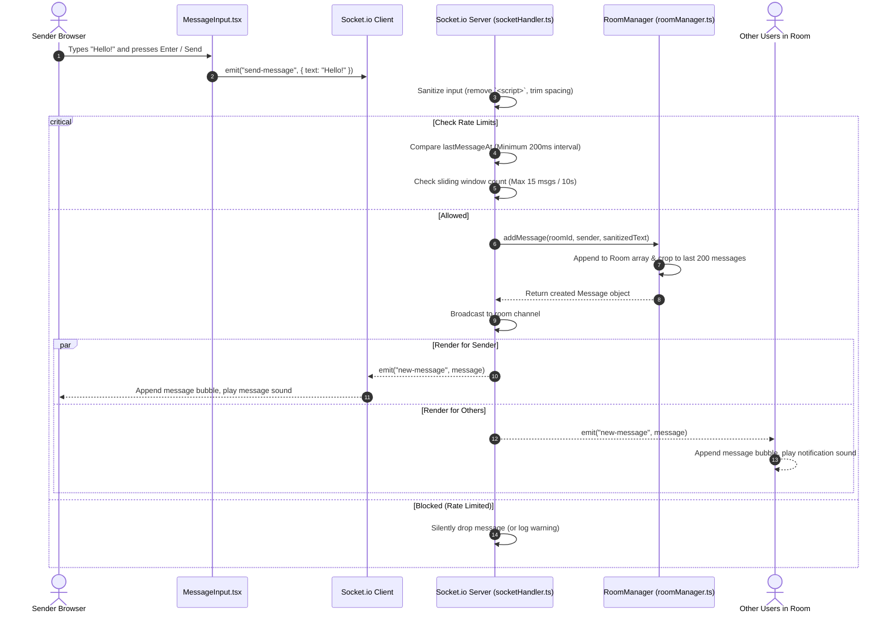
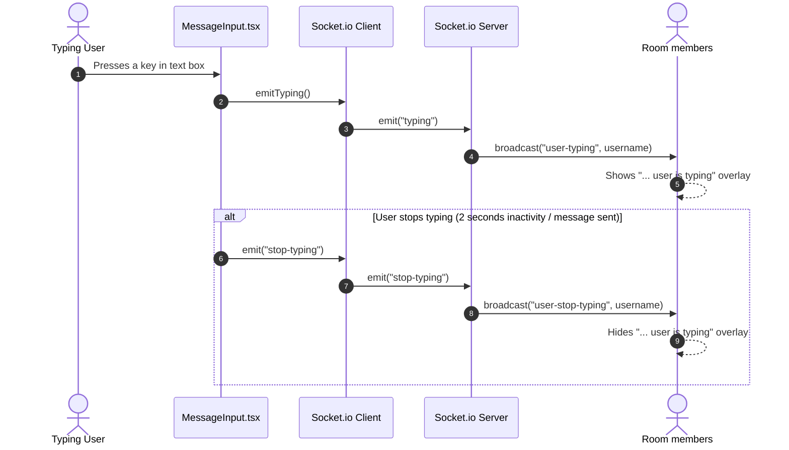
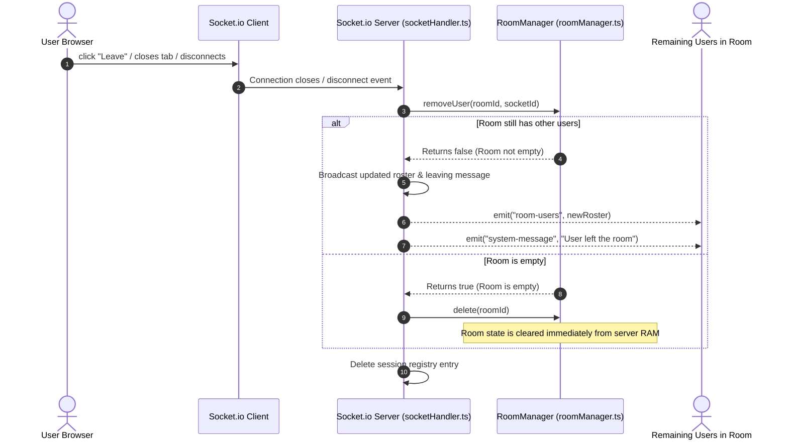

# ✦ Whisper Chat — Architecture & Communication Guide ✦

Welcome to **Whisper Chat**, a premium, secure, real-time, room-based chat application. This document details the frontend and backend architectures, the complete list of files, and how real-time socket communication works between them.

---

## 📂 Project Structure

The project is structured as a monorepo containing two primary directories:
1. `backend` — A high-performance Node.js / Express socket server.
2. `chatapp` — A modern, beautiful React / TypeScript user interface.

```
simple_chat/
├── backend/                  # Node.js + Socket.io Server
│   ├── src/
│   │   ├── index.ts          # Server entrypoint & graceful shutdown
│   │   ├── socketHandler.ts  # Socket.io event & rate limits coordinator
│   │   ├── roomManager.ts    # In-memory room & message state manager
│   │   ├── types.ts          # TS Interfaces for events and payloads
│   │   ├── utils.ts          # Input sanitization, IDs, and logging
│   │   └── constants.ts      # Config limits & sweep timer configs
│   ├── tsconfig.json
│   └── package.json
│
└── chatapp/                  # React + Vite Frontend
    ├── src/
    │   ├── main.tsx          # Client entrypoint
    │   ├── App.tsx           # Screen routing & client orchestrator
    │   ├── index.css         # Global design tokens & CSS system
    │   ├── App.css           # Premium layout styling & effects
    │   ├── components/       # Component library
    │   │   ├── WakeScreen.tsx        # Server spin-up animation
    │   │   ├── JoinScreen.tsx        # Room & name selector
    │   │   ├── ChatScreen.tsx        # Main layout manager
    │   │   ├── MessageList.tsx       # Message thread with auto-scroll
    │   │   ├── MessageBubble.tsx     # Message bubbles (Sent/Received)
    │   │   ├── MessageInput.tsx      # Text area with typing triggers
    │   │   ├── Sidebar.tsx           # Active users list drawer
    │   │   ├── AmbientBackground.tsx # Moving glassmorphism gradients
    │   │   ├── TypingIndicator.tsx   # Floating typing indicators
    │   │   └── SystemMessage.tsx     # Leave/Join/Disconnect notifications
    │   ├── hooks/
    │   │   ├── useSocket.ts          # Custom hook for Socket.io events
    │   │   ├── useSounds.ts          # Sound alerts library
    │   │   └── useViewport.ts         # Mobile CSS height variables fixer
    │   ├── utils/
    │   │   └── helpers.ts            # Formatting & UI helpers
    │   └── types/
    │       └── index.ts              # UI screen & entry definitions
    ├── vite.config.ts
    └── package.json
```

---

## 🔗 Code Reference Map

Click directly on any of the source files below to inspect their implementation details:

### Backend Architecture
*   [backend/src/index.ts](file:///c:/MyCode/nestjs/simple_chat/backend/src/index.ts) — App boots, configures Express middlewares (CORS, trust proxy), starts the Socket.IO server, and sets up process shutdown hooks.
*   [backend/src/socketHandler.ts](file:///c:/MyCode/nestjs/simple_chat/backend/src/socketHandler.ts) — Manages connections, applies rate-limiting, and translates incoming client events into state adjustments.
*   [backend/src/roomManager.ts](file:///c:/MyCode/nestjs/simple_chat/backend/src/roomManager.ts) — An in-memory singleton class containing all active rooms, active members, and capped historical logs.
*   [backend/src/types.ts](file:///c:/MyCode/nestjs/simple_chat/backend/src/types.ts) — Type definitions enforcing consistency between client-emitted and server-broadcasted events.
*   [backend/src/constants.ts](file:///c:/MyCode/nestjs/simple_chat/backend/src/constants.ts) — Hard-coded constraints like rate limit window durations, max message lengths, and timeouts.
*   [backend/src/utils.ts](file:///c:/MyCode/nestjs/simple_chat/backend/src/utils.ts) — Sanitization regex engines (e.g., stripping HTML scripts to block XSS) and high-speed ID generators.

### Frontend Componentry
*   [chatapp/src/App.tsx](file:///c:/MyCode/nestjs/simple_chat/chatapp/src/App.tsx) — Main orchestrator showing either `waking`, `join`, or `chat` screen, checking if the server is awake before proceeding.
*   [chatapp/src/hooks/useSocket.ts](file:///c:/MyCode/nestjs/simple_chat/chatapp/src/hooks/useSocket.ts) — Hooks the component state to standard websocket flows (`message-history`, `new-message`, `user-typing`, etc.).
*   [chatapp/src/components/ChatScreen.tsx](file:///c:/MyCode/nestjs/simple_chat/chatapp/src/components/ChatScreen.tsx) — Arranges header, message window list, typing alerts, text fields, and side drawers in a premium layout.

---

## ⚡ How the Chat Works (Communication Flow)

Whisper Chat relies on **bi-directional, real-time message passing** using WebSocket protocol via `socket.io`. Below are detailed visual flows of the key chat lifecycles.

### 1. Waking and Verification Handshake
When the client boots up, it initiates a warming check before letting users join rooms. This ensures server availability (especially when hosted on environments that spin down due to inactivity).



---

### 2. Room Joining Flow
To send messages, users must join a room with a **Username** and a **Room ID**. All messages are contextualized by Room IDs.



---

### 3. Message Propagation & Rate Limiting
To prevent abuse, the backend implements sliding-window rate limiting.



---

### 4. Real-time Typing Indicators
When users type, indicators flash immediately without saving state on the database.



---

### 5. Client Departure & Disconnect Cleanup
When a tab is closed or a user clicks "Leave Room":



---

## 🔒 Security and Safeguards

### In-Memory Storage
All states (rooms, connected lists, message arrays) are stored strictly in RAM (`roomManager.ts`). No databases are hooked up, ensuring messages disappear forever once a room becomes vacant or the server restarts.

### Sweep Cleanup Daemon
A background sweep job runs periodically on the backend to prevent memory leaks from inactive rooms (e.g. rooms with zero active connections):
*   **Trigger Interval:** Every 5 minutes (`STALE_ROOM_CHECK_INTERVAL_MS`).
*   **Idle Room Threshold:** 30 minutes (`ROOM_INACTIVITY_TIMEOUT_MS`).
*   **Action:** Deletes empty rooms that haven't registered activity during this window.

### Anti-Spam Rate Limits
*   **Minimum Interval:** 200 milliseconds between consecutive messages per socket connection.
*   **Maximum Bandwidth:** 15 messages per 10-second sliding window.
*   **Payload Size Limit:** Cap of 100KB per JSON payload to avoid memory exhaustion attacks.

### XSS Prevention
*   Every incoming username and message passes through input sanitization (`utils.ts`).
*   Cleanses standard HTML tag shapes using regex (`/<[^>]*>/g`) to guarantee text displays as string literals, preventing script injections on the frontend.
