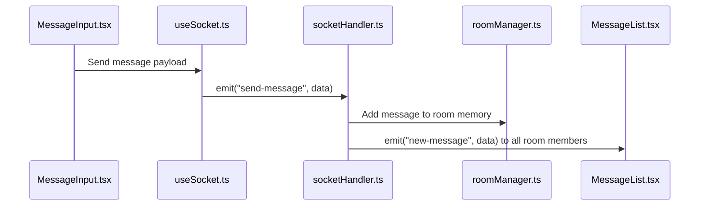
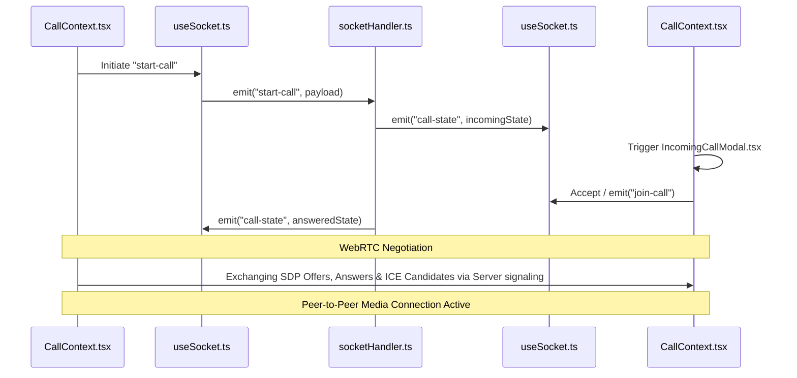

# 🌐 Whisper Chat — Project Directory & Architecture Analysis

Welcome to the **Whisper Chat** project analysis. This document provides a complete breakdown of the workspace, explaining the purpose of each directory and file across both the backend server and frontend client application.

---

## 📁 High-Level Directory Overview

The project is split into two primary folders:
1. **`backend/`** — A Node.js + TypeScript server running Express and Socket.IO to manage real-time communication, room routing, and WebRTC signaling.
2. **`chatapp/`** — A modern React single-page application built with Vite, TypeScript, and customized vanilla CSS for high-performance rendering and a premium look.

```
nestjs/simple_chat/
├── backend/                # Real-time WebSocket & HTTP server
│   ├── src/                # Backend source code
│   └── package.json        # Node dependency configurations
│
└── chatapp/                # Vite + React + TypeScript frontend
    ├── public/             # Static public assets
    ├── src/                # Client source code
    │   ├── assets/         # Images, icons, and audio assets
    │   ├── components/     # UI elements (Chat, Calls, Sidebar, etc.)
    │   ├── hooks/          # Custom utility React hooks
    │   ├── types/          # Shared interfaces & TypeScript types
    │   ├── utils/          # Formatting & validation utilities
    │   └── webrtc/         # WebRTC calling context & media/peer managers
    └── package.json        # Frontend dependency configurations
```

---

## ⚙️ Backend Module Breakdown (`backend/`)

The backend functions as a light-weight state coordinator. Rooms, user directories, messages, and calls are stored **in-memory** for rapid real-time performance.

### `backend/src/` Files & Descriptions

*   [index.ts](file:///c:/MyCode/nestjs/simple_chat/backend/src/index.ts)
    *   **Purpose:** The main entry point of the server.
    *   **Key Tasks:** Instantiates the Express app, attaches the Node HTTP server, boots the Socket.IO server, runs periodic sweeps of inactive chat rooms, and handles graceful shutdowns on `SIGINT`/`SIGTERM` to clean up resources cleanly.
*   [socketHandler.ts](file:///c:/MyCode/nestjs/simple_chat/backend/src/socketHandler.ts)
    *   **Purpose:** Handles all WebSocket events between client and server.
    *   **Key Tasks:** Listens for connection initialization, manages joins/leaves, triggers typing indicators, routes private and public messages, handles rate-limiting, and relays WebRTC signaling (`offer`, `answer`, `ice-candidate`) between calling peers.
*   [roomManager.ts](file:///c:/MyCode/nestjs/simple_chat/backend/src/roomManager.ts)
    *   **Purpose:** Manages room lifecycles and historical message logs.
    *   **Key Tasks:** Keeps track of active rooms, users in each room, and capped message history (to prevent memory leaks), and cleans up rooms that have had no user activity for a prolonged period.
*   [callManager.ts](file:///c:/MyCode/nestjs/simple_chat/backend/src/callManager.ts)
    *   **Purpose:** Manages WebRTC active call sessions.
    *   **Key Tasks:** Keeps track of active audio or video call status within specific rooms, records participants list and their toggled media states, and determines when a call has been answered or needs to be terminated.
*   [types.ts](file:///c:/MyCode/nestjs/simple_chat/backend/src/types.ts)
    *   **Purpose:** Type definitions for all payloads and WebSocket events.
    *   **Key Tasks:** Declares strict types for client-to-server and server-to-client events, guaranteeing type safety and autocomplete support.
*   [constants.ts](file:///c:/MyCode/nestjs/simple_chat/backend/src/constants.ts)
    *   **Purpose:** Holds system configuration values.
    *   **Key Tasks:** Configures parameters like the maximum message payload size, message rate limiting thresholds, socket timeout/ping intervals, and room cleanup intervals.
*   [utils.ts](file:///c:/MyCode/nestjs/simple_chat/backend/src/utils.ts)
    *   **Purpose:** Contains helper utilities for the server.
    *   **Key Tasks:** Standard logger configuration (`info`, `warn`, `error` styling) and token generators.

---

## 🎨 Frontend Module Breakdown (`chatapp/`)

The frontend application uses **Vite** for speedy builds, **React** for user interface state management, and **WebRTC** APIs for peer-to-peer calling.

### `chatapp/src/` Directories & Key Files

#### 1. Core Config & Layout
*   [main.tsx](file:///c:/MyCode/nestjs/simple_chat/chatapp/src/main.tsx): Mounts the React application into the DOM index container.
*   [App.tsx](file:///c:/MyCode/nestjs/simple_chat/chatapp/src/App.tsx): Manages the top-level navigation screen routing (swapping between the welcome screen, room-join screen, and active chat interface).
*   [index.css](file:///c:/MyCode/nestjs/simple_chat/chatapp/src/index.css): Sets up the application's global design theme including HSL variables, root layouts, fonts, scrollbar designs, and ambient color templates.
*   [App.css](file:///c:/MyCode/nestjs/simple_chat/chatapp/src/App.css): Layout details for chat grids, sidebar, messages, and calls.

#### 2. Components (`src/components/`)
*   [AmbientBackground.tsx](file:///c:/MyCode/nestjs/simple_chat/chatapp/src/components/AmbientBackground.tsx): An animated background with gradient orbs to create a premium UI atmosphere.
*   [WakeScreen.tsx](file:///c:/MyCode/nestjs/simple_chat/chatapp/src/components/WakeScreen.tsx): Initial welcome landing screen when opening the app.
*   [JoinScreen.tsx](file:///c:/MyCode/nestjs/simple_chat/chatapp/src/components/JoinScreen.tsx): Simple, modern form prompting the user for a username and a Room ID to start chatting.
*   [ChatScreen.tsx](file:///c:/MyCode/nestjs/simple_chat/chatapp/src/components/ChatScreen.tsx): The main dashboard layout binding the sidebar, header, list, and input sections together.
*   [ChatHeader.tsx](file:///c:/MyCode/nestjs/simple_chat/chatapp/src/components/ChatHeader.tsx): Displays current room information, connected user count, and contains action buttons to trigger video or audio calls.
*   [Sidebar.tsx](file:///c:/MyCode/nestjs/simple_chat/chatapp/src/components/Sidebar.tsx): Retractable panel listing active users in the room.
*   [MessageList.tsx](file:///c:/MyCode/nestjs/simple_chat/chatapp/src/components/MessageList.tsx): Auto-scrolling grid container displaying messages and system notifications.
*   [MessageBubble.tsx](file:///c:/MyCode/nestjs/simple_chat/chatapp/src/components/MessageBubble.tsx): Renders individual message text, sender name/avatar, and provides interactions to edit or delete messages.
*   [MessageInput.tsx](file:///c:/MyCode/nestjs/simple_chat/chatapp/src/components/MessageInput.tsx): Dynamic input bar with typing indicator hooks, emojis, and message validation.
*   [SystemMessage.tsx](file:///c:/MyCode/nestjs/simple_chat/chatapp/src/components/SystemMessage.tsx): Stylized center-aligned notices (e.g., "Alice joined the chat").
*   [TypingIndicator.tsx](file:///c:/MyCode/nestjs/simple_chat/chatapp/src/components/TypingIndicator.tsx): Floating visual dots notifying users when someone else is composing a message.

#### 3. Call Sub-Components (`src/components/call/`)
*   [CallScreen.tsx](file:///c:/MyCode/nestjs/simple_chat/chatapp/src/components/call/CallScreen.tsx): A wrapper UI that overlays the chat screen whenever a call is connected or dialled.
*   [CallHeader.tsx](file:///c:/MyCode/nestjs/simple_chat/chatapp/src/components/call/CallHeader.tsx): Displays the call metadata, connection status, and duration counter.
*   [VideoGrid.tsx](file:///c:/MyCode/nestjs/simple_chat/chatapp/src/components/call/VideoGrid.tsx): Organizes active callers in a responsive grid layout.
*   [ParticipantTile.tsx](file:///c:/MyCode/nestjs/simple_chat/chatapp/src/components/call/ParticipantTile.tsx): Embeds local/remote `<video>` and `<audio>` streams and tracks specific speaker stats.
*   [CallControls.tsx](file:///c:/MyCode/nestjs/simple_chat/chatapp/src/components/call/CallControls.tsx): Command tray with buttons to toggle microphone (mute/unmute), video (camera on/off), and leave/end the call.
*   [IncomingCallModal.tsx](file:///c:/MyCode/nestjs/simple_chat/chatapp/src/components/call/IncomingCallModal.tsx): Prompts the recipient to accept or decline the call, featuring a ringing loop.
*   [OutgoingCallModal.tsx](file:///c:/MyCode/nestjs/simple_chat/chatapp/src/components/call/OutgoingCallModal.tsx): Waiting overlay for the caller until the remote peer answers.

#### 4. Custom Hooks (`src/hooks/`)
*   [useSocket.ts](file:///c:/MyCode/nestjs/simple_chat/chatapp/src/hooks/useSocket.ts): Connects to the backend server socket, manages lifecycle, and handles reconnection gracefully.
*   [useSounds.ts](file:///c:/MyCode/nestjs/simple_chat/chatapp/src/hooks/useSounds.ts): Standardizes Web Audio API triggers for sound effects (ringing, message notifications, user joins).
*   [useViewport.ts](file:///c:/MyCode/nestjs/simple_chat/chatapp/src/hooks/useViewport.ts): Listens to window resizing to toggle between desktop layouts and mobile drawer states.
*   [useMedia.ts](file:///c:/MyCode/nestjs/simple_chat/chatapp/src/hooks/useMedia.ts) & [usePeerConnection.ts](file:///c:/MyCode/nestjs/simple_chat/chatapp/src/hooks/usePeerConnection.ts): Low-level hardware permission and connection handlers.

#### 5. Real-Time Calling Layer (`src/webrtc/`)
*   [CallContext.tsx](file:///c:/MyCode/nestjs/simple_chat/chatapp/src/webrtc/CallContext.tsx): The central React context coordinating local streams, remote peer links, incoming/outgoing ring states, and mapping signals to Socket.IO.
*   [MediaManager.ts](file:///c:/MyCode/nestjs/simple_chat/chatapp/src/webrtc/MediaManager.ts): Wraps `navigator.mediaDevices` stream acquisition, tracks active device selections, and handles cleanups.
*   [PeerManager.ts](file:///c:/MyCode/nestjs/simple_chat/chatapp/src/webrtc/PeerManager.ts): Encapsulates raw `RTCPeerConnection` signaling exchanges, adding/removing tracks, and registering ICE candidates.

---

## 🔄 Real-Time Signal Architecture

Below is a sequence showing how events are routed through the application's folder structure.

### 💬 Text Chat Flow


### 📞 WebRTC Audio/Video Call Flow


---

## 🏆 Project Highlights

1.  **Strict Typing:** Type-safe communication contract ensures that editing files in `backend/` and `chatapp/` won't result in runtime API shape mismatches.
2.  **No Bulky Databases:** The server handles all state in-memory with automatic cleanup, keeping hosting overhead extremely lightweight.
3.  **Modern CSS Customization:** The application utilizes highly responsive vanilla CSS gradients, grid structures, and variable tokens for sleek transitions and layout changes without relying on heavy external styling libraries.
